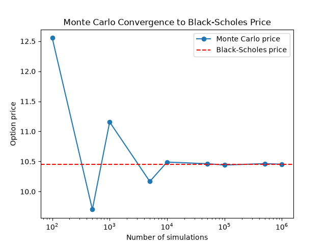
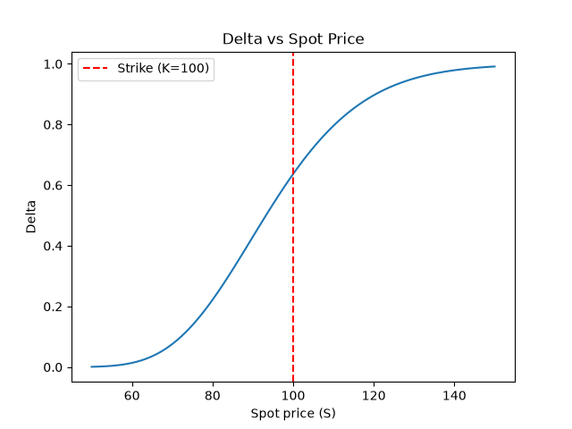
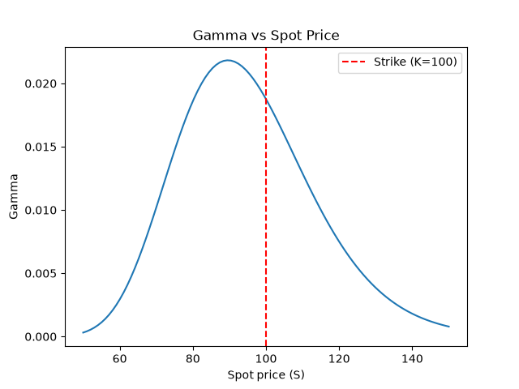

# Options Pricer
 
A Python implementation of European option pricing that combines closed-form
Black-Scholes pricing with Monte Carlo simulation and computes option
Greeks analytically and using finite differences.
 
## Features
 
- **Black-Scholes pricing** — closed-form pricing for European calls and puts
- **Monte Carlo pricing** — simulates terminal stock prices via geometric
  Brownian motion under the risk-neutral measure and prices options as the
  discounted average payoff
- **Convergence analysis** — illustrates that Monte Carlo price converges to the
  Black-Scholes price as the simulation count increases
- **Greeks** — delta, gamma and vega are computed analytically and using finite 
  differences, cross-validated against each other
- **Tested** — validated against known values, edge-case behaviour (deep 
  in/out-of-the-money, short maturities) and put-call parity

## Maths
 
Black-Scholes prices a European option as the discounted expected payoff
under a risk-neutral probability measure and assumes the underlying follows
geometric Brownian motion:
 
```
Call: C = S·N(d1) - K·e^(-rT)·N(d2)
Put:  P = K·e^(-rT)·N(-d2) - S·N(-d1)
```
 
where `N(d2)` is the risk-neutral probability the option finishes in the
money and `N(d1)` adjusts for receiving the underlying asset itself rather
than cash.
 
**Monte Carlo pricing** uses a different route to the same theoretical
quantity, by simulating many possible terminal stock prices and computes
the option's payoff under each one, then takes the average, then discounts 
the result back to today. As the number of simulations increases, this 
estimate converges to the Black-Scholes price, due to the Law of Large Numbers.
 
**The Greeks** are the partial derivatives of the pricing function with
respect to its inputs i.e. delta (`∂Price/∂S`), gamma (`∂Delta/∂S`) and vega
(`∂Price/∂σ`). We computed them in two independent ways, analytically,
using their closed-form Black-Scholes expressions and numerically, using
finite differences (where we bumped an input slightly and measured the resulting
change in price). The two methods agree closely so this validates that both are 
implemented correctly.
 
## Setup
 
```bash
python -m venv venv
source venv/bin/activate
pip install -r requirements.txt
```
 
## Usage
 
```python
from option import EuropeanOption
 
opt = EuropeanOption(S=100, K=100, T=1, r=0.05, sigma=0.2, option_type='call')
 
opt.black_scholes_price()  # closed-form price
opt.monte_carlo_price(100000)  # simulation-based price
 
opt.delta()  # analytical Greeks
opt.gamma()
opt.vega()
 
opt.delta_fd()  # finite-difference Greeks
opt.gamma_fd()
opt.vega_fd()
```
 
## Results
 
### Monte Carlo convergence
 

 
The Monte Carlo price estimate converges to the Black-Scholes price as
the number of simulations increases, as well as the estimate's variance
decreasing as expected.
 
### Greeks vs. spot price
 


 
Delta traces an S-shaped curve, we observe that it moves from near 0 (deep 
out-of-the-money) to near 1 (deep in-the-money). Gamma peaks near the strike 
price, where the option's price is most responsive to small moves in the 
underlying.
 
## Testing
 
```bash
pytest
```
 
Covers: at-the-money pricing against known values, deep in/out-of-the-money
and short-maturity edge cases, put-call parity and agreement between
analytical and finite-difference Greeks.
 
## What I learned
 
Building both a closed-form and simulation-based options pricer side by side 
was a useful way to see the same theoretical result obtained through two 
different routes, where one is exact and one is statistical. Implementing
finite-difference Greeks alongside the analytical versions also taught me a 
numerical methods lesson, as gamma's finite-difference approximation becomes 
unstable at very small step sizes, because dividing by `h²` amplifies tiny 
floating-point errors, hence we see that smaller step size is not always more 
accurate in numerical computation.
